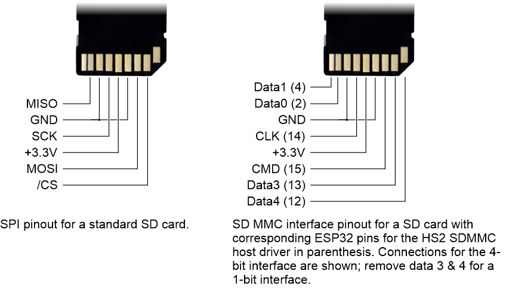
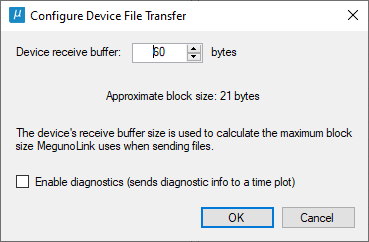

This Arduino library implements reading and writing files on embedded file systems (e.g., 
an SD card) using MegunoLink's device file transfer visualizer. The library implements 
the protocols required to communicate with MegunoLink and access the file system. It 
supports:
* SD card connected to an SPI bus on any device that supports the standard Arduino SD library,
* SD cards on ESP32 using the [SD MMC bus](https://docs.espressif.com/projects/esp-idf/en/latest/esp32/api-reference/peripherals/sdmmc_host.html) (1 bit or 4 bit bus),
* [LittleFS](https://github.com/espressif/arduino-esp32/tree/master/libraries/LittleFS) on ESP32 and ESP8266, which uses onboard flash to implement a file system. 

The library currently supports reading/writing files in a single directory, which defaults
to the root folder. 

# Library Installation
Install the library using the [Arduino IDE's library manager](https://docs.arduino.cc/software/ide-v1/tutorials/installing-libraries). 
The Device File Manager library relies on the core [MegunoLink library for Arduino](https://www.megunolink.com/documentation/arduino-library/). 
The MegunoLink library for Arduino can be installed using the Arduino IDE's library
manager or [MegunoLink's Arduino integration setup](https://www.megunolink.com/documentation/install/installing-megunolink/). 

You may also need to install the [SD card library for Arduino](https://www.arduino.cc/reference/en/libraries/sd/) if you are not using an Esprissif device. 
The ESP32 and ESP8266 include a custom SD card library so the Arduino SD library isn't needed for these devices. [LittleFS](https://github.com/espressif/arduino-esp32/tree/master/libraries/LittleFS) is part of the Arduino ESP32 core; be sure to use version 4.2.0 or higher to avoid bugs. 

# Hardware Connection
SD cards can be connected to the SPI bus found on most Arduino microcontrollers, or the SDMMC bus found on a small number of devices such as the ESP32. 

SD cards operate at 3.3&nbsp;V so you'll need a level shifter such as the [SparkFun microSD shield](https://www.sparkfun.com/products/12761)  if your Arduino operates at 5&nbsp;V. Otherwise you can connect the SD card directly to the Arduino, the diagram below shows the SD card pinout. ArtsyEngineering has a good video on [connecting SD cards to the ESP32](https://www.youtube.com/watch?v=e1xOgZsnAuw). The ESP32's SDMMC bus works with both 1-bit and 4-bit connections. The 4-bit interface provides a roughly 20% improvement in speed over the 1-bit interface at the cost of two extra pins (data 3 and 4 are not required for the 1-bit interface). 



The following development boards include an SD card ready to go:
* [Lolin D32 Pro](https://www.wemos.cc/en/latest/d32/d32_pro.html) &mdash; ESP32 board with SD card connected to the SPI bus
* [Micro SD card shield](https://www.wemos.cc/en/latest/d1_mini_shield/micro_sd.html) &mdash; SD card breakout board for the ESP8266 SPI bus
* [Thing Plus C](https://www.sparkfun.com/products/18018) &mdash; ESP32 board with SD card connected to the SPI bus
* [ESP32 Cam](https://www.arducam.com/esp32-machine-vision-learning-guide/) &mdash; ESP32 board with SD camera connected to the SDMMC bus

Accessing SD cards over the 1-bit SDMMC interface instead of the SPI bus can be around 3 times faster for reading and twice as fast for writing. The 4-bit SDMMC interface is a little faster again (about 20%). So it is worth it if the bus is available. 

The LittleFS file system uses flash memory on the device and doesn't require any additional hardware. 

# Using the Library
Check out the included examples for using device file transfer with [SD cards over an SPI bus](examples/SDCard/SDCard.ino), [SD cards over a SDMMC bus](examples/SDMMCCard/SDMMCCard.ino) and [device flash using LittleFS](examples/LittleFS/LittleFS.ino).

The library includes a protocol module for each supported file system interface (see table below). Include the appropriate file at the start of your Arduino sketch  (see code snippet below). 

| File system     | Include file       | Protocol module class|
| --------------- | ------------------ | ---------------------|
| SD, SPI bus     | SDFileManager.h    | SDFileManager        |
| SD, SDMMC bus   | SDMMCFileManager.h | SDMMCFileManager     |
| Flash, LittleFS | LittleFS.h         | LittleFSFileManager  |

These protocol modules use MegunoLink's [command handler](https://www.megunolink.com/documentation/arduino-libraries/serial-command-handler/) to decode and dispatch commands. Use `#include "CommandHandler.h"` to include the command handler at the start of your Arduino sketch. 

Register a static instance of the appropriate protocol module with the command handler in your Arduino program as part of the Arduino setup function by calling `Cmds.AddModule(&FileManager);` (see code snippet below). 

The file system should also be initialized as part of your Arduino setup function. It is not automatically initialized by the library. Refer to the Arduino library examples for the [SD](https://www.arduino.cc/reference/en/libraries/sd/), [SDMMC](https://github.com/espressif/arduino-esp32/tree/master/libraries/SD_MMC/examples/SDMMC_Test) or [LittleFS](https://github.com/espressif/arduino-esp32/tree/master/libraries/LittleFS/examples/LITTLEFS_test) library for appropriate initialization, or the examples included in this library. 

Make sure to call both the `CommandHandler`'s and `FileManager`'s process function as part of the Arduino loop (see code snippet below). The command handler's process function decodes and dispatches commands from MegunoLink. The file manager's process function closes cached file handles if communication with MegunoLink is lost (the file manager maintains open file handles while sending or receiving data to improve performance). 

```
#include "CommandHandler.h"
#include <SDFileManager.h>

// Command handler instance
const int MaxCommands = 10;
const int MaxSerialBuffer = 60; // bytes
CommandHandler<MaxCommands, MaxSerialBuffer> Cmds;

// File manager instance.
SDFileManager FileManager;

  :
  :

void setup()
{
  Serial.begin(500000);

  Cmds.AddModule(&FileManager);

  InitSDCard();
}

void loop()
{
  Cmds.Process();
  FileManager.Process();
}
```

The default command handler receive buffer (30 characters) is too small for the device file transfer visualizer to send files from MegunoLink to your device. Increasing the command handler buffer to 60 bytes is recommended for your Arduino program to receive files from MegunoLink. The [command handler buffer size](https://www.megunolink.com/documentation/arduino-libraries/serial-command-handler/#Command_Buffer_Size) is set with the second template parameter: 
```
const int MaxCommands = 10;
const int MaxSerialBuffer = 60; // bytes
CommandHandler<MaxCommands, MaxSerialBuffer> Cmds;
```

The same buffer size **must** be set in the device file transfer visualizer in MegunoLink too. Click the *set device buffer size* button on the device file transfer visualizer toolbar in MegunoLink and enter the serial buffer size from your Arduino sketch:




# Configuration
Use the `SetOptions` method to configure the file manager:
* `FileManager.SetOptions(FileManagerOptions::DisableDeletion)` to block commands that delete files or clear all files. 
* `FileManager.SetOptions(FileManagerOptions::AllowFileDeletion)` to allow individual files to be deleted but prevent clearing all files.
* `FileManager.SetOptions(FileManagerOptions::AllowClearCard)` to allow clearing the card of all files but prevent deletion of individual files. 
* `FileManager.SetOptions(FileManagerOptions::AllowDeletion)` to allow both deleting individual files and clearing the card of all files. 
